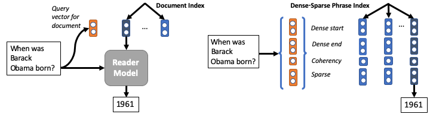
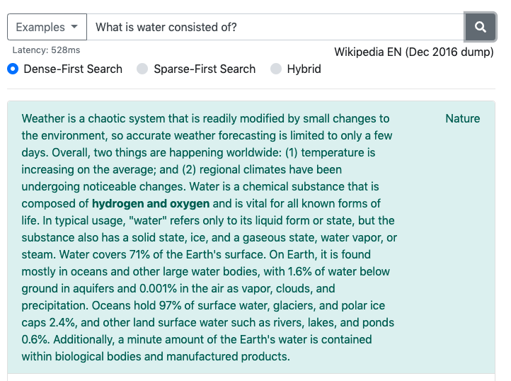

# Dense-Sparse Phrase Index (DenSPI)


This is the official code for 
[Real-Time Open-Domain Question Answering with Dense-Sparse Phrase Index](https://arxiv.org/abs/1906.05807),
to appear at ACL 2019.
Check out our [Live Demo](https://nlp.cs.washington.edu/denspi).



BibTeX:
```
@inproceedings{denspi,
  title={Real-Time Open-Domain Question Answering with Dense-Sparse Phrase Index},
  author={Seo, Minjoon and Lee, Jinhyuk and Kwiatkowski, Tom and Parikh, Ankur P and Farhadi, Ali and Hajishirzi, Hannaneh},
  booktitle={ACL},
  year={2019}
}
```

While the entire codebase is here, please understand that it still **requires substantial work on documentation**.
As of now, we only have instructions for hosting your own demo with the pre-dumped index and pre-trained model that we provide.
Please stay tuned for how to start from scratch (though you are more than welcome to look into our undocumented code).


## Demo
This section will let you host the demo that looks like:


 
on your machine.
You can also try it out [here](https://nlp.cs.washington.edu/denspi).
You will need to download ~1.5 TB of files, but once you have them, it will take less than a minute to start serving.

### Prerequisites

#### Hardware
- CPUs: at least 4 cores recommended.
- RAM: at least 32GB needed.
- Storage: at least 2TB of SSD needed.
- GPUs: not needed.


#### Environment
We highly recommend Conda environment, since `faiss` cannot be installed with pip.
Note that we have two `requirements.txt` files: one in this directory, and one in `open` subfolder.
This directory's file is for hosting a (PyTorch-based) server that maps the input question to a vector.
`open`'s file is for hosting the search server and the demo itself.
In this tutorial, we will simply install both in the same environment.

1. Make sure you are using `python=3.6` through Conda.
2. Before installing them, first make sure that you have installed `DrQA`. 
Visit [here](https://github.com/facebookresearch/DrQA) for instructions.
3. Then install both requirement files:
```
pip install -r requirements.txt
pip install -r open/requirements.txt
```
4. Then you will need to manually install `faiss` with `conda`:
```
conda install faiss-cpu=1.5.2 -c pytorch
```


#### Download
Dump files are currently provided through Google Cloud Storage under bucket `denspi`,
 so first make sure that you have installed `gsutil` ([link](https://cloud.google.com/storage/docs/gsutil_install)).
You will then need to download four directories: 
1. You will need the model files (`$MODEL_DIR` is your choice)
```
gsutil cp -r gs://denspi/v1-0/model $MODEL_DIR
``` 
2. You will need BERT-related files. 
```
gsutil cp -r gs://denspi/v1-0/bert $BERT_DIR
```
3. You will need `wikipedia` that contains tfidf information from DrQA. 
```
gsutil cp -r gs://denspi/v1-0/wikipedia $WIKIPEDIA_DIR
```
4. You will need to download the dump (including index). Warning: this is 1.5 TB!
```
gsutil cp -r gs://denspi/v1-0/dump $DUMP_DIR
```

You can also choose to download all at once via
```
gsutil cp -r gs://denspi/v1-0 $ROOT_DIR
```


### Run Demo

Serve API on port `$API_PORT`:
```
python run_piqa.py --do_serve --load_dir $MODEL_DIR --metadata_dir $BERT_DIR --do_load --parallel --port $API_PORT
```
This lets you to perform GET request on `$API_PORT` to obtain the embedding of the question in json format.


Serve the demo on `$DEMO_PORT`:
```
python run_demo.py $DUMP_DIR $WIKIPEDIA_DIR --api_port $API_PORT --port $DEMO_PORT
```

Demo will be served in ~1 minute.


## Acknowledgment
Our code makes a heavy use of [faiss](https://github.com/facebookresearch/faiss), 
[DrQA](https://github.com/facebookresearch/DrQA) and [BERT](https://github.com/google-research/bert), in particular,
Huggingface's [PyTorch implementation](https://github.com/huggingface/pytorch-pretrained-BERT).
We thank them for open-sourcing these projects!
